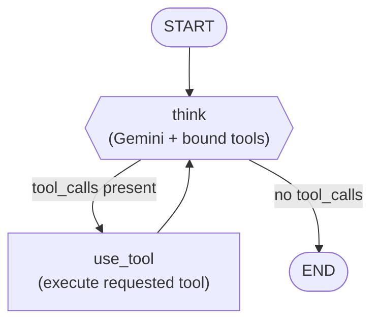

# Simple LangGraph Agent

A minimal LangGraph agent powered by Gemini Flash, with tool-calling and optional Langfuse tracing.

## Orchestration flow

The graph has two nodes and one piece of conditional routing between them:



**State** (`AgentState`) is a single field: `messages`, a list of LangChain messages
accumulated via LangGraph's `add_messages` reducer — every node returns only the
*new* messages to append, not the full history.

**Node behavior:**

1. **think** — takes the running `messages` list, prepends the system prompt if
   it isn't already there, and calls `llm.bind_tools(TOOLS).invoke(messages)`.
   The response is one `AIMessage`, which either contains plain text or a
   `tool_calls` payload (Gemini decides which, based on the system prompt and
   the user's question).
2. **route_after_think** (conditional edge) — inspects the last message. If it
   has `tool_calls`, route to `use_tool`; otherwise route to `END`.
3. **use_tool** — iterates over every requested tool call, looks up the tool by
   name in `TOOLS_BY_NAME`, invokes it with the model-provided args, and wraps
   each result in a `ToolMessage` (matched to its `tool_call_id`). These get
   appended to `messages` and control returns to `think`, so the model sees
   the tool output on its next turn.

This loop (`think` → `use_tool` → `think`) repeats until the model is satisfied
it has enough information to answer directly, at which point `think` returns a
plain-text `AIMessage` and the graph ends.

**Example trace** for "Use your web_search tool to look up langfuse, then summarize":

```
HumanMessage  "Use your web_search tool to look up langfuse, then summarize."
AIMessage     tool_calls=[{name: "web_search", args: {query: "langfuse"}}]
ToolMessage   "[mocked search result for 'langfuse']: Langfuse is an open-source..."
AIMessage     "Langfuse is an open-source observability, tracing, and evaluation platform..."
```

**Tracing:** if `LANGFUSE_PUBLIC_KEY`/`LANGFUSE_SECRET_KEY` are set,
`get_langfuse_handler()` builds a `langfuse.langchain.CallbackHandler`, which
`main.py` passes as a callback on every `agent.invoke(...)` call. Langfuse then
records a trace per invocation, with a span for each `think`/`use_tool` node
run and nested generations for the underlying Gemini calls — visible in the
Langfuse UI grouped by trace.

## Tools

- `calculator` — evaluates basic arithmetic expressions (`+ - * / % **`) via a
  restricted AST walk (no `eval`), so it only ever executes numeric operations.
- `web_search` — mocked web search; returns canned summaries for a few known
  topics (langgraph, gemini, langfuse) or a generic placeholder otherwise. Swap
  the body of `web_search` in `tools.py` for a real search API to make this
  agent actually search the web.

## Setup

From the repo root:

```bash
python -m venv .venv        # if you don't already have one
source .venv/bin/activate
pip install -r requirements.txt
```

Create a `.env` file in the repo root (gitignored) with:

```
GOOGLE_API_KEY=your-gemini-api-key
GEMINI_MODEL=gemini-flash-latest

LANGFUSE_PUBLIC_KEY=
LANGFUSE_SECRET_KEY=
LANGFUSE_HOST=https://us.cloud.langfuse.com
```

- `GOOGLE_API_KEY` is required. Get one from [Google AI Studio](https://aistudio.google.com/apikey).
- `LANGFUSE_PUBLIC_KEY` / `LANGFUSE_SECRET_KEY` are optional — leave blank to run without tracing. Langfuse Cloud has separate US and EU regions with different hosts and keys; make sure `LANGFUSE_HOST` matches the region your keys were created in.

## Run

```bash
cd simple_agent
python main.py
```

This runs 3 automatic test questions, then drops into an interactive prompt. Type `exit` or `quit` to stop.
