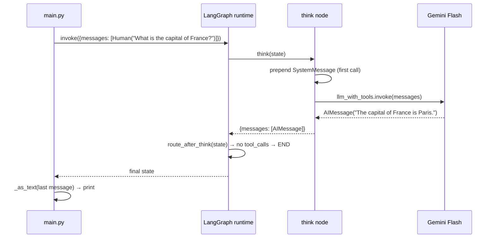
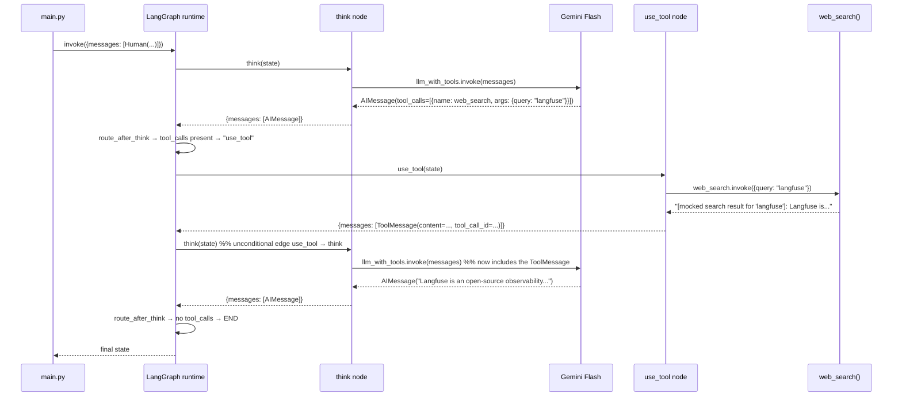

# Execution flow

This traces exactly what happens, call by call, for one question in each of
the two possible paths through the graph. Line numbers refer to the current
`agent.py` / `main.py`.

## Entry point: `main.py`

```python
agent = build_agent()                    # main.py — compiles the graph once
handler = get_langfuse_handler()         # None if Langfuse keys aren't set
callbacks = [handler] if handler else []
...
result = agent.invoke(
    {"messages": [HumanMessage(content=question)]},
    config={"callbacks": callbacks},
)
answer = _as_text(result["messages"][-1].content)
```

Every question — whether one of the 3 automated test questions or something
typed in the interactive loop — goes through `ask()`, which calls
`agent.invoke(...)` with a **fresh** `messages` list containing just that one
`HumanMessage`. There is no cross-question memory in this example: each
`invoke` starts a new `AgentState` from scratch (see
[01-what-makes-it-an-agent.md](01-what-makes-it-an-agent.md#whats-deliberately-not-here)).

## Path A — direct answer, no tool needed

Example: `"What is the capital of France?"`



State after this run (`messages`):

```
1. SystemMessage(SYSTEM_PROMPT)      # added inside think, not part of invoke's input
2. HumanMessage("What is the capital of France?")
3. AIMessage("The capital of France is Paris.")
```

Only one `think` call happened; `route_after_think` saw no `tool_calls` and
sent the graph straight to `END`.

## Path B — one tool-call round trip

Example: `"Use your web_search tool to look up langfuse, then summarize."`



State after this run:

```
1. SystemMessage(SYSTEM_PROMPT)
2. HumanMessage("Use your web_search tool to look up langfuse, then summarize.")
3. AIMessage(tool_calls=[{name: "web_search", args: {"query": "langfuse"}, id: "call_..."}])
4. ToolMessage(content="[mocked search result for 'langfuse']: ...", tool_call_id="call_...")
5. AIMessage("Langfuse is an open-source observability, tracing, and evaluation platform...")
```

`think` ran **twice** here — once to decide to call the tool, once more to
turn the tool's result into a final answer. If the model had requested a
second tool call after seeing the first result, the `use_tool → think` edge
would send it through `use_tool` again, and so on; nothing in the graph
limits the number of iterations (a real system might add a max-turn counter
to `AgentState` to guard against infinite loops with a misbehaving model —
this example doesn't need one since the mocked tools always return quickly).

## Why the model output looks like a list of blocks, not a plain string

`main.py`'s `_as_text()` helper exists because some Gemini responses come
back as `AIMessage.content = [{"type": "text", "text": "...", "extras": {...}}]`
instead of a plain string — a structured content-block format rather than
bare text. `_as_text` flattens either shape down to a printable string so
`main.py` doesn't need to care which one it got.

## Where tests would hook in

Because `build_agent()` returns a plain compiled LangGraph object, and
`ask()` is a small pure-ish wrapper around `agent.invoke`, either can be
exercised directly in a test without going through `main()`'s I/O loop —
e.g. asserting that a given `HumanMessage` input produces an `AIMessage`
with the expected `tool_calls`, independent of what Gemini actually returns,
by monkeypatching `llm_with_tools`.
